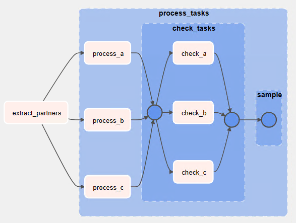
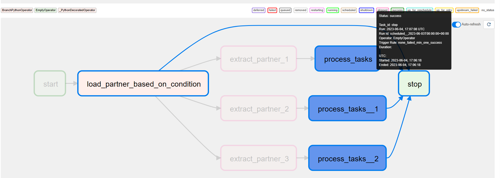
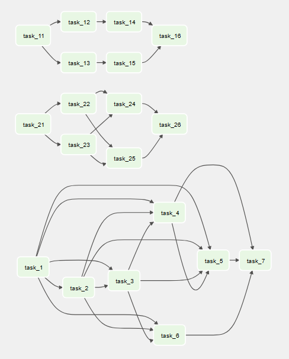

# Learning notes

This file contains random learnings notes I kept while attending the amazing courses in <https://academy.astronomer.io/>.
Most of the knowledge is documented in the python files as comments.

Used the following formatters:

```bash
autoflake8 -i -r .
black .
```

## Notes dump

New Dag files will appear:

- 30sec Web
- 5min scheduler

- DagRun <- Scheduler
- TaskInstance <- Executor

start_date: tasks start being scheduled
schedule_interval: from the min(start_date) as which DAG is triggered
executions_date: start_date for the first run
effectively triggered at executions_date + schedule_interval
2nd run's executions_date = start_date + schedule_interval
e.g.

@daily or `0 0 * * *` doesn't account for start hour.
vs timedelta(days=1) based on previous execution. Timedelta also accounts for every 3 days pattern which is dif in cron.

One operator -> One task
Tasks should be idempotent.
e.g. CREATE TABLE IF NOT EXISTS
e.g. mkdir my_folder will fail then 2nd time.

DAG_DISCOVERY_SAFE_MODE to parse all files, not just the ones with DAG or Airflow.
Can add .airflowignore

Clear state reruns the dag runs.
Latest Dag run executes automatically when you unpause the dag.

In XComs you store references to data and not the data on their own to avoid out of memory exceptions.

There are six methods to create variables in Airflow: Airflow UI ✔️, CLI ✔️, REST API ✔️, environment variables 💎, secret backend 💎, and programmatically 🤔. The choice depends on use case and personal preference.
Creating a variable with an environment variable allows **avoiding DB connections** 💎 and *hiding* 🤔 sensitive values.
Connections can also be created with environment variables by exporting the AIRFLOW_CONN_NAME_OF_CONNECTION.
For a secure way to store variables or connections, use a Secret Backend. Airflow checks for variable/connection existence in the following order:

1. Secret Backends
1. Environment
1. Meta DB.

[Secret Backend](https://airflow.apache.org/docs/apache-airflow/stable/administration-and-deployment/security/secrets/secrets-backend/index.html).

In the Dockerfile I added a variable:

```Dockerfile
FROM quay.io/astronomer/astro-runtime:8.4.0

ENV AIRFLOW_VAR_DAG_AUTHORING_01_ENVIRONMENT_VARIABLE='{"name":"test from env", "path":"/tmp"}'
```

Task groups in dag_authoring_06_task_groups_cleaner:


Trigger rule for branching in dag_authoring_08_branching:


Dependencies in dag_authoring_09_dependencies:


## Concurrency

`parallelism` = 32 task per scheduler in Airflow, regardless of the worker count.
`dag_concurrency` = 16 tasks per DAG (Deprecated) -> max_active_tasks_per_dag
`max_active_runs_per_dag` = 16 Runs per DAG

In the code you can do the following:

```python
@dag(... 
  concurrency=2, max_active_runs=2
)
```

`concurrency`: At most 2 tasks across all DAGruns
`max_active_runs`: At most 1 DAGruns for this dag.

```python
@task(... 
  task_concurrency=1, pool='default_pool', pool_slots=1
)
```

`task_concurrency`: At most 1 task for all DAGruns of this DAG.
`pool`: In UI Admin -> List Pool the default one has 128 slots.
`pool_slots`: how many slots this task consumes

SubDagOperator has a pool but it **won't be used** in the tasks.

## Weighting

By default, Airflow’s weighting method is downstream. You can find other weighting methods in airflow.utils.WeightRule.
You assign that in the default_args of a DAG.


From <https://airflow.apache.org/docs/apache-airflow/stable/administration-and-deployment/priority-weight.html>:

OPTIONS:

downstream

The effective weight of the task is the aggregate sum of all downstream descendants. As a result, upstream tasks will have higher weight and will be scheduled more aggressively when using positive weight values. This is useful when you have multiple DAG run instances and desire to have all upstream tasks to complete for all runs before each DAG can continue processing downstream tasks.

upstream

The effective weight is the aggregate sum of all upstream ancestors. This is the opposite where downstream tasks have higher weight and will be scheduled more aggressively when using positive weight values. This is useful when you have multiple DAG run instances and prefer to have each DAG complete before starting upstream tasks of other DAG runs.

absolute

The effective weight is the exact priority_weight specified without additional weighting. You may want to do this when you know exactly what priority weight each task should have. Additionally, when set to absolute, there is bonus effect of significantly speeding up the task creation process as for very large DAGs

TIP: Use priority 99 in the default args of a DAG to boost the priority of the specific DAG.

Read more: <https://towardsdatascience.com/3-steps-to-build-airflow-pipelines-with-efficient-resource-utilisation-b9f399d29fb3>

Depends on past (`depends_on_past=True` at the `@task` definition) is only for tasks, not for the entire DAG. So even if all tasks have depends on past, the DAGruns will run but the tasks may not be triggered and won't have any status. This is why you need timeout on the DAGRun, otherwise, it will wait for ever. This property is evaluated, even on manual runs. It won't be evaluated the first time you run a DAG. It will be evaluated in the backfill process. Note that the tasks executes even if skipped, so success or skipped previous status.

To give it a try:

```python
default_args = {
  ...
  "retries": 0
}

@task.python(..., depends_on_past=True, ...)
def fn():
  raise ValueError()
```

For downstream you only check the direct downstream task with `wait_for_downstream`, not subsequent ones. Once set, the `depends_on_past` is also set to true, which makes sense. This is very useful if you have race conditions.

The `on_[success,failure,retry]_callback` delegates are not retried if the method you specify throws an error. `on_retry_callback` is only for tasks. Signature of these callbacks is:

```python

def _failure_callback(context):
  from airflow.exceptions import AirflowTaskTimeout, AirflowSensorTimeout
  if (context['exception']):
    if (isinstance(context['exception'], AirflowTaskTimeout)):
      ...

def _retry_callback(context):
  if (context['ti'].try_number()> 2):
    ...


```

SLA is related to DAG's execution date and not the tasks start time. So if you specify 5 mins for a task and the previous task took more than 5 mins, then the task will start with missed SLA. SLA handler is defined at the DAG level, not per task.

Be careful when removing tasks from DAGs because you will loose access to the logs of the previous executions.
If a task is queued/triggered, the new version won't be taken into account.
Best practice: Suffix your DAGs with versions _1_0_0. A versioning mechanism will be available soon.

## Dynamic DAGs

Two approaches, the dynamic generation one with the following code which may lead to `zombie` DAGs 🤔:

```python
from airflow import DAG
from airflow.decorators import task
from datetime import datetime

partners = {
    'partner_1': {
        'schedule': '@daily',
        'path': '/data/partner_1'
    },
    'partner_2': {
        'schedule': '@weekly',
        'path': '/data/partner_2'
    }, 
}

def generate_dag(dag_id, schedule_interval, details, default_args):

    with DAG(dag_id, schedule_interval=schedule_interval, default_args=default_args) as dag:
        @task.python
        def process(path):
            print(f'Processing: {path}')
            
        process(details['path'])

    return dag

for partner, details in partners.items():
    dag_id = f'dag_{partner}'
    default_args = {
        'start_date': datetime(2021, 1, 1)
    }
    globals()[dag_id] = generate_dag(dag_id, details['schedule'], details, default_args)
```

T4 template based generation one which generates one file for each argument 💎. With that you have all DAGs in place and won't be generated every time DAGs are parsed.
